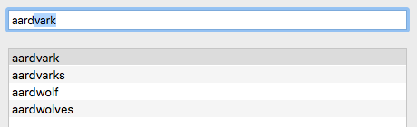

# RxOmnibar

Reactive extensions for [Omnibar](https://github.com/CleanCocoa/Omnibar), a search field with support for auto-completion of typed strings.

## Overview

Made to satisfy these needs:

1. Quickly filter search results;
2. Change result selection through use of the arrow keys from within the Omnibar;
3. Offer auto-completion of the search term inside the text field itself.

So if you type "aard", the Omnibar will suggest the term "aardvark" in the example app:

    

## Reactive Extension

Once you have a reference to `omnibar: Omnibar`, the reactive extension `.rx` offers this:

- `omnibar.rx.text` which behaves just like `NSTextField().rx.text` and sends the whole contents while the user is typing -- it's like a stream of `stringValue` property changes;
- `omnibar.rx.contentChange` emits the changed content, either a `.replacement` or `.continuation`;
- `omnibar.rx.moveSelection` emits either `.previous` (up arrow key) or `.next` (down arrow key);
- `omnibar.rx.content` takes in any `OmnibarContent` value to change the text being displayed.

# Attributions and Contributions

## English Open Word List (EOWL) v1.1.2

The sample app uses a list of 12000+ english words to display and filter.

> The “English Open Word List” (EOWL) was developed by Ken Loge, but is almost entirely derived from the “UK Advanced Cryptics Dictionary” (UKACD) Version 1.6, by J Ross Beresford.

- [English Open Word List](http://dreamsteep.com/projects/the-english-open-word-list.html)
- "UK Advanded Cryptics Dictionary" was formerly available at <http://cfaj.freeshell.org/wordfinder/UKACD17.shtml> but is now down

## License

### Omnibar

Copyright (c) 2017 Christian Tietze. Distributed under the MIT License.

### English Open Word List (EOWL)

Copyright © J Ross Beresford 1993-1999. All Rights Reserved. The following restriction is placed on the use of this publication: if the UK Advanced Cryptics Dictionary is used in a software package or redistributed in any form, the copyright notice must be prominently displayed and the text of this document must be included verbatim.

